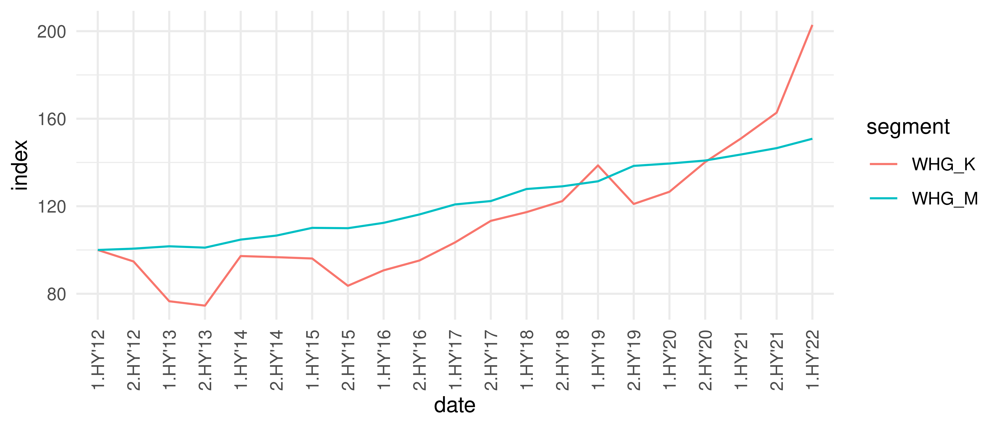

<!-- README.md is generated from README.Rmd. Please edit that file -->

# valueR 

The goal of valueR is to facilitate access to real estate market data
from VALUE AG’s Market Data team via our API interfaces with R.

## Development

This package emerged from our own analyses of VALUE market data using R
that we would like to make available to our users. The package is still
under active development and we are happy to receive hints on
enhancements to the functionality.

## Installation

You can install the development version of valueR from
[GitHub](https://github.com/) with:

``` r
# install.packages("devtools", dependencies = T)
devtools::install_github("alfonx/valueR")
```

## API

With valueR you can access two of our REST-APIs:

##### **ANALYST**

VALUE ANALYST is based on our real estate market database, which
provides up-to-date and comprehensive information on prices, rents and
yields of the German real estate market. Most users access our database
via our GUI “Analyst”, we therefore refer to this access as “Analyst” in
the context of valueR.

If you have a VALUE license with API/REST access, you can find the
Swagger documentation [here](https://api.value-marktdaten.de/api-docs/).

##### **AVM**

VALUE AVM is a fully comprehensive solution for automated value
indication and system-supported derivation of market and lending values.
With the AVM, different value indications and also object and location
parameters can be fetched. The latter are currently not yet implemented
in valueR.

If you have a VALUE license with AVM-API/REST access, you can find the
Swagger documentation
[here](https://avm-api.value-marktdaten.de/v1/api-docs/).

## USAGE

To access VALUE Analyst and VALUE AVM you need a license with individual
access data for each. Without valid credentials, the use of valueR is
pointless. Please contact us if you would like a [trial
license](https://www.value-marktdaten.de/en/contact/).

To load the package, run

``` r
library(valueR)
```

You will be asked to provide you credentials using `valuer_access()`:

``` r
#> Unable to connect to AVM.
#> Unable to connect to ANALYST.
#> Please connect with valuer_access() to AVM or ANALYST.
```

To avoid having to enter credentials every time, valueR recognizes the
following system variables:

-   VALUER_ANALYST_USER

-   VALUER_ANALYST_PW

-   VALUER_AVM_USER

-   VALUER_AVM_PW

It is highly recommended to set these variable using `Sys.setenv()` in
[.Renviron](https://support.rstudio.com/hc/en-us/articles/360047157094-Managing-R-with-Rprofile-Renviron-Rprofile-site-Renviron-site-rsession-conf-and-repos-conf).

Developers with access to our testing-systems might also set
`VALUER_AVM_URL` and `VALUER_ANALYST_URL` which both default to our
live-systems if not provided.

Once you have provided your credentials, you will be logged in:

``` r
#> Connected to AVM: https://avm-api.value-marktdaten.de/v1
#> Connected to ANALYST: https://api.value-marktdaten.de/
```

## ANALYST EXAMPLES

First, you might check the system status by

``` r
analyst_status()
```

There are some information on your license, e.g. the segments of your
license

``` r
analyst_segments() %>% dplyr::select(key, titleEn) %>% head(5)
#>        key                                                   titleEn
#> 1    WHG_M                                 Flats/apartments for rent
#> 2    WHG_K                             Flats/apartments for purchase
#> 3   EZFH_K                     Single/two-family houses for purchase
#> 4   EZFH_M                         Single/two-family houses for rent
#> 5 MFHWGH_K Multi-family houses, residential and commercial buildings
```

your licensed variables

``` r
analyst_vars() %>% dplyr::select(key, titleEn) %>% head(5)
#>                      key                         titleEn
#> 1             aadr_firma        Company name of provider
#> 2 aadr_gewerblich_janein             Commercial provider
#> 3           aadr_telefon    Telephone number of provider
#> 4             angebot_id                              ID
#> 5    anz_balkon_terrasse Number of balconies or terraces
```

or spatial information

``` r
analyst_spatial(type = 'municipalities') %>% head(5) %>% dplyr::select(municipalityCode,municipality)
#>   municipalityCode municipality
#> 1          1001000    Flensburg
#> 2          1002000         Kiel
#> 3          1003000       Lübeck
#> 4          1004000   Neumünster
#> 5          1051001   Albersdorf
```

Each of these functions return a `data.frame()` inlcuding all available
descriptions.

To start a query, you must create a query on a given segment, with the
provided filter conditions using `analyst_id()`. The returned ID can be
used in subsequent API requests to access the data described by this
query. The ID is only valid for 6 hours, before it expires and has to be
posted again. A query must be provided as JSON, e.g.

``` r
id <- analyst_id(json = '{"segment": "WHG_K","administrativeSpatialFilter": {"postalCodes": [23558]}}',query_id = T)
id
#> [1] 17780526
```

To create a valid JSON, you can also create a query in our ANALYST GUI
and get the corresponding JSON output. Note that due to `query_id = T`,
`analyst_id()` will return only an integer that can be used for further
requests that return an object of class `list`.

This class is a structured list of objects from which you can choose. In
most cases, you probably want to refer to `values` that include a tidy
`data.frame()` of results. But you might also use the returned `JSON` to
start a new query. Let’s say, you want to create an ID for the
counterpart to your original request, you could than use
`analyst_queries()` to get the counterpart

``` r
counterpart <- analyst_queries(id = id, subquery = 'counterpart')
```

and then getting a new ID for that counterpart:

``` r
counterpart$json
#> {"segment":["WHG_M"],"administrativeSpatialFilter":{"postalCodes":[23558]}}

id_counter <- analyst_id(json = counterpart$json,query_id = T)
id_counter
#> [1] 17791137
```

You’re then ready to get all results of your original request and its
counterpart using `analyst_results()`. E.g. to get a timeline of both
requests, set `subquery = 'timeline'` and provide `yearParts`.

``` r

# Leave variable empty to get available variables:
analyst_results(id, subquery = 'timeline', yearparts = 2)$values$key
#> You will find available variables to get timeline results for your queryId 17780526 at values$keys.
#> [1] "einnahmen_kaufpreisfaktor" "einnahmen_rendite"        
#> [3] "kosten_je_flaeche"         "kstn_kaufpreis"

orig <- analyst_results(id, subquery = 'timeline', variable = 'kosten_je_flaeche', yearparts = 2) 
orig_seg <- analyst_queries(id = id, subquery = 'queryId')$values$segment # get segment of ID
orig_v <- orig$values %>% dplyr::mutate(segment = orig_seg)

counter <- analyst_results(id_counter, subquery = 'timeline', variable = 'kstn_miete_kalt_pqm', yearparts = 2)
counter_seg <- analyst_queries(id = id_counter, subquery = 'queryId')$values$segment # get segment of counter ID
counter_v <- counter$values %>% dplyr::mutate(segment = counter_seg)

# combine both queries and compute index to plot results:

results <- orig_v %>% dplyr::bind_rows(counter_v) %>% 
    dplyr::group_by(segment) %>% 
    dplyr::mutate(index = value / value[date == min(date)] * 100)
```



With `analyst_results()` and the corresponding ID, all predefined
results can be retrieved. You can also get all single offers of the
query by setting `subquery = 'offers'` to run your own statistics and
analysis.

Please also note that the ANALYST API also includes an endpoint to
retrieve georeferencing of an address. Currently, this endpoint cannot
be accessed with valueR. This limitation should also be fixed soon.

## AVM EXAMPLES

coming soon upon request…
